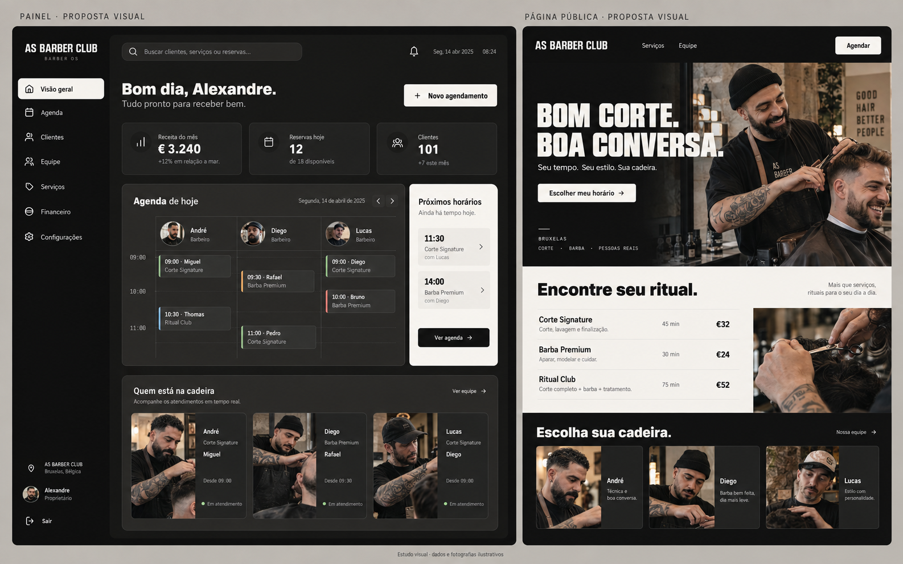

# Barber OS — proposta de repaginação visual

Data: 11/09/2026. Status: conceito para revisão; implementação não iniciada.

## Pedido e limite

Dar personalidade e presença humana ao front-end, separar fundo e cards e apresentar uma imagem antes de implementar. Preservar backend, banco, autenticação, permissões, regras e contratos atuais. O histórico de 09/09 pede conservar cores e tipografias; esta proposta conserva a família grafite/branco e as fontes existentes, com maior diferença tonal entre superfícies.

## Conferência do GitHub

Repositório confirmado no histórico enviado pelo usuário: https://github.com/onetakebe/barber-os.

- `main` remota e HEAD remoto consultados em 11/09: `68a10be25c3d24fb1c2b6cc043f1519ed5f1222d`.
- Branch local: `main`, commit `9a6b311`, um commit à frente e nenhum atrás do HEAD remoto consultado.
- Antes desta proposta: 19 arquivos rastreados modificados, 662 inserções e 132 exclusões; seis entradas não rastreadas, incluindo diretórios de fotos e componentes de agenda.
- O commit extra contém documentação e imagem para vídeo. As alterações não commitadas incluem front-end e backend preexistentes.
- Portanto, a pasta local NÃO está idêntica ao GitHub. Nenhum pull, reset, troca de branch ou push foi executado.
- Os arquivos desta entrega acrescentam apenas documentação e uma imagem em `docs/design/`.

## Diagnóstico observado

Inspecionados no navegador a página pública e o painel autenticado da conta de demonstração na prévia local, porta 3011. A porta 3000 respondia 404 para `/painel`, por isso foi iniciada uma prévia separada deste diretório.

1. O padrão geométrico do fundo chama atenção, mas as superfícies dos cards ainda se aproximam demais da base.
2. A sequência de indicadores, gráfico e caixas tem peso visual semelhante; a operação diária fica abaixo do gráfico.
3. Textos como “Dados do tenant em tempo real”, “no tenant” e “Banco” expõem implementação ao usuário.
4. O gráfico vazio ocupa muita área. Estado sem movimento precisa continuar honesto, porém mais compacto e útil.
5. Fotos já existem em `public/images/` e os profissionais já possuem componentes de imagem; a proposta deve aproveitar essa base.
6. A referência antiga “Barbearia Exclusiva” foi recuperada como descrição no Segundo Cérebro; o arquivo original daquela referência não foi localizado. Não alegamos comparação pixel a pixel com ela.

## Direções consideradas

| Direção | Resultado | Contrapartida |
|---|---|---|
| Grafite acolhedor — recomendada | Mantém identidade; aumenta contraste, respiro e presença humana | Exige tratar hierarquia e composição além de ajustar cores |
| Estúdio claro | Superfícies claras dominantes, excelente separação | Muda bastante o caráter escuro previamente solicitado |
| Clube clássico | Dourado, títulos serifados, atmosfera tradicional | Troca fontes e acento e se aproxima de templates comuns do nicho |

## Direção recomendada

- Base `#10100F`; área de trabalho `#1C1C1A`; cards `#2A2926`; bordas discretas `#45433E`; texto secundário `#B7B4AE`; branco quente `#F3F1EC`.
- A paleta é proposta, não validação de acessibilidade. Medir contraste no CSS final, inclusive hover, foco, seleção e textos pequenos.
- Manter Archivo Black nos títulos expressivos da página pública, Space Grotesk nos títulos do painel, Geist no corpo e Geist Mono em horários/números. A imagem gerada aproxima tipografia; não é especificação exata de fontes.
- Painéis administrativos com cantos coordenados próximos de 16px, espaçamento de 20–24px e fundos opacos. Diminuir caixas dentro de caixas e retirar o padrão repetido atrás da área útil.
- Agenda e próximos horários ganham prioridade no painel. Financeiro e indicadores continuam acessíveis, respeitando as permissões existentes.
- Cor de profissional apenas como apoio, sempre acompanhada de nome/foto; estados não devem depender só da cor.
- Uma superfície clara pontual destaca os próximos horários. Fotografia no painel aparece junto à equipe; na página pública ganha protagonismo.
- Página pública alterna grafite, fotografia e seção clara de serviços. Fotos com luz natural, gestos de trabalho, textura de pele e expressão espontânea.
- Retratos gerados servem à demonstração. Para um estabelecimento real, usar fotos autorizadas da equipe; imagens geradas de ambiente não devem se passar por documentação do espaço real.
- Substituir linguagem técnica por rótulos úteis: “Seu dia”, “Clientes”, “Receita do mês”, “Próximos horários”.

## Prévia

Imagem gerada com a ferramenta nativa de geração de imagens. É um estudo de direção, não uma captura de software implementado. Números, percentuais, datas, nomes associados a reservas e fotografias são ilustrativos. Não levar resultados ou taxas inventadas à aplicação. O mockup contém uma data ilustrativa de 2025; o produto deve usar sua data real. Cabeçalhos tipográficos e alguns detalhes não reproduzem exatamente as fontes e dados existentes.

O bloco “Quem está na cadeira” não autoriza inventar estado de atendimento. Na implementação, usar equipe e informações efetivamente disponíveis; se o backend não expõe um estado confiável, apresentar “Equipe” sem afirmar presença ao vivo.

Resumo do prompt: composição frontal de duas telas, painel e página pública do AS Barber Club; grafite quente, cards mais claros, branco quente pontual, fontes sans existentes, agenda em destaque, retratos naturais e fotografia de atendimento; sem dourado, neon, manchas decorativas ou alteração de funcionalidades.

## Sequência sugerida após revisão do conceito

1. Preservar e revisar as alterações locais existentes antes de qualquer integração com GitHub. Não sincronizar sobrescrevendo trabalho local.
2. Ajustar os tokens de superfície, espaçamentos, contraste e shell. Examinar impactos globais antes de alterar `globals.css`.
3. Reorganizar `/painel` com os dados já retornados, mantendo as verificações de acesso. Destacar agenda/horários e compactar estados vazios.
4. Refinar visualmente `/agenda`, incluindo contraste de blocos, cabeçalhos e fotos. Não acrescentar arrastar/reagendar, visões ou mutações que não estejam disponíveis hoje.
5. Aplicar o mesmo sistema à página pública e ao wizard existente, preservando a sequência e regras da reserva. Gerar fotografias complementares selecionadas e otimizar os arquivos para web.
6. Conferir desktop e celular, contraste, teclado, zoom, estados vazios e fotos ausentes. Verificar acesso por função e fluxo de reserva. Rodar checagem de tipos/lint e testes pertinentes às partes efetivamente alteradas.

Arquivos candidatos: `src/app/globals.css`, `src/components/layout/dashboard-shell.tsx`, `src/app/(dashboard)/painel/page.tsx`, componentes visuais da agenda, página pública e wizard. Não alterar `src/server/`, Server Actions, Prisma, banco ou integrações para executar esta repaginação.

## Referências consultadas

- [SQUIRE](https://getsquire.com/): página atual inspecionada visualmente; combina tipografia forte, fotografia de profissionais e produto de agendamento. Referência de ligação entre produto e pessoas, não de copiar seu fundo preto ou cores.
- [Fellow Barber](https://www.fellowbarber.com/): navegação destaca barbeiros e reserva por localização, além do conteúdo editorial de estilo.
- [Ruffians](https://ruffians.co.uk/pages/about-ruffians): história do negócio, pessoas e experiência de atendimento.
- [Schorem](https://schorembarbier.nl/): personalidade própria ancorada no ofício e cultura da barbearia.
- [Mangomint](https://www.mangomint.com/): referência de produto de gestão e reserva no segmento.

Essas são referências atuais consultadas, não um ranking comprovado de popularidade. A recomendação visual é uma interpretação de design adaptada ao Barber OS.
